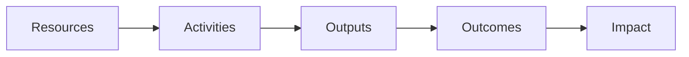

### Chapter 1: What are Outcomes

* You can manage a team by telling them what to make: that's called managing outputs. It's a problem, because features don't always deliver value.
* You can manage a team by asking them to create some high-level value, like growing revenue. That's called managing impact. It's a problem because it's not specific enough.
* What you wnat to do is manage with outcomes: ask teams to create a specific customer behavior that drives business results. That allows the team to find the right solution, and keeps them focused on delivering value. 
* For our purposes, an outcome is "a change in customer behavior that drives business results."
* Defining outcomes in terms of customer behaviors creates a more customer-centric and user-centric way or working.
* Outcomes and Agility: using outcomes to direct the work of your teams unlocks your team's creativity. They will work to find the best solution to the problem at hand in order to create the outcome you seek.
* To figure out is your outputs create the outcomes you seek, you need to test and run experiments. MVP is just a buzzword that means "experiment."

