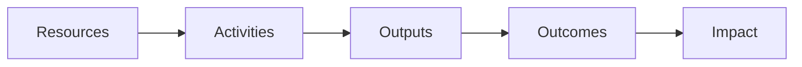

### Chapter 1: What are Outcomes

[Resources] --> [Activities] --> [Outputs] --> [Outcomes] --> [Impact]

* You can manage a team by telling them what to make: that's called managing outputs. It's a problem, because features don't always deliver value.
* You can manage a team by asking them to create some high-level value, like growing revenue. That's called managing impact. It's a problem because it's not specific enough.
* What you wnat to do is manage with outcomes: ask teams to create a specific customer behavior that drives business results. That allows the team to find the right solution, and keeps them focused on delivering value. 
* For our purposes, an outcome is "a change in customer behavior that drives business results."
* Defining outcomes in terms of customer behaviors creates a more customer-centric and user-centric way or working.
* Outcomes and Agility: using outcomes to direct the work of your teams unlocks your team's creativity. They will work to find the best solution to the problem at hand in order to create the outcome you seek.
* To figure out is your outputs create the outcomes you seek, you need to test and run experiments. MVP is just a buzzword that means "experiment."

### Chapter 2: Using Outcomes

*  Dont mistake impact - high-level aspirational goals - for outcomes. Impact is important, but it's too big for any one group to target.
*  Use the magic questions to define outcomes: What are the human behaviors that drive business results? How can we get people to do more of these things? How will we know we're right?
*  Remember that by "humans" we mean customers, users, employees, stakeholders, or anyone involved in the system we are building. 
*  When you're planning work, be clear about your assumptions. Be prepared to test your assumptions by expressing work as hypotheses. Test your hypotheses by continuously by working in small iterations, experimenting, and responding to the data and feedback you collect.
*  Use outcomes to track progress. Leading indicators tell you that you're going to hit or miss your target. Lagging indicators show your target. Build an understanding of what behaviors *lead to* achieving the *targets* you seek.
*  Use outcomes (not features) to plan initiatives. Ask "what new behaviors will this initiative create that will deliver business value? How can we deliver that value sooner?"
*  OKRs can be improved if you think of the Key Result as an outcome.

### Chapter 3: Outcomes-Based Planning

* Planning with outputs limits a team's agility and problem-solving flexibility. Increase a team's capabilities here by planning around outcomes.
* Create outcomes-based roadmaps that list questions, themes, and outcomes instead of features.
* One way to find outcomes is to create Customer Journey Maps. These maps help visualize how systems work in terms of customer (and employee) behavior, and so can help you find important outcomes in the system. 

